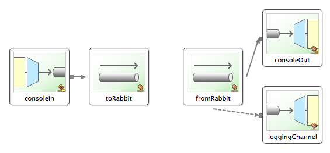

[[amqp]]
= AMQP Support

[[amqp-introduction]]
== Introduction

Spring Integration provides Channel Adapters for receiving and sending messages using the Advanced Message Queuing Protocol (AMQP). The following adapters are available: 
	        
Inbound Channel Adapter

			
Outbound Channel Adapter

			
Inbound Gateway

			
Outbound Gateway

Spring Integration also provides a point-to-point Message Channel as well as a publish/subscribe Message Channel backed by AMQP Exchanges and Queues.

In order to provide AMQP support, Spring Integration relies on Spring AMQP (http://www.springsource.org/spring-amqp[http://www.springsource.org/spring-amqp]) which "applies core Spring concepts to the development of AMQP-based messaging solutions". Spring AMQP provides similar semantics as Spring JMS (http://static.springsource.org/spring/docs/current/spring-framework-reference/html/jms.html[http://static.springsource.org/spring/docs/current/spring-framework-reference/html/jms.html]).

Whereas the provided AMQP Channel Adapters are intended for unidirectional Messaging (send or receive) only, Spring Integration also provides inbound and outbound AMQP Gateways for request/reply operations.

TIP: Please familiarize yourself with the reference documentation of the Spring AMQP project as well. It provides much more in-depth information regarding Spring's integration with AMQP in general and RabbitMQ in particular.

 You can find the documentation at: http://static.springsource.org/spring-amqp/reference/html/[http://static.springsource.org/spring-amqp/reference/html/]

[[amqp-inbound-channel-adapter]]
== Inbound Channel Adapter

A configuration sample for an AMQP Inbound Channel Adapter is shown below.

[source,xml]
----
<int-amqp:inbound-channel-adapter
                                  id="inboundAmqp"TBD Section qName:co level:4, chunks:[] attrs:[id:amqp-inbound-channel-adapter-xml-01-co, linkends:amqp-inbound-channel-adapter-xml-01]
                                  channel="inboundChannel"TBD Section qName:co level:4, chunks:[] attrs:[id:amqp-inbound-channel-adapter-xml-02-co, linkends:amqp-inbound-channel-adapter-xml-02]
                                  queue-names="si.test.queue"TBD Section qName:co level:4, chunks:[] attrs:[id:amqp-inbound-channel-adapter-xml-03-co, linkends:amqp-inbound-channel-adapter-xml-03]
                                  acknowledge-mode="AUTO"TBD Section qName:co level:4, chunks:[] attrs:[id:amqp-inbound-channel-adapter-xml-04-co, linkends:amqp-inbound-channel-adapter-xml-04]
                                  advice-chain=""TBD Section qName:co level:4, chunks:[] attrs:[id:amqp-inbound-channel-adapter-xml-05-co, linkends:amqp-inbound-channel-adapter-xml-05]
                                  channel-transacted=""TBD Section qName:co level:4, chunks:[] attrs:[id:amqp-inbound-channel-adapter-xml-06-co, linkends:amqp-inbound-channel-adapter-xml-06]
                                  concurrent-consumers=""TBD Section qName:co level:4, chunks:[] attrs:[id:amqp-inbound-channel-adapter-xml-07-co, linkends:amqp-inbound-channel-adapter-xml-07]
                                  connection-factory=""TBD Section qName:co level:4, chunks:[] attrs:[id:amqp-inbound-channel-adapter-xml-08-co, linkends:amqp-inbound-channel-adapter-xml-08]
                                  error-channel=""TBD Section qName:co level:4, chunks:[] attrs:[id:amqp-inbound-channel-adapter-xml-09-co, linkends:amqp-inbound-channel-adapter-xml-09]
                                  expose-listener-channel=""TBD Section qName:co level:4, chunks:[] attrs:[id:amqp-inbound-channel-adapter-xml-10-co, linkends:amqp-inbound-channel-adapter-xml-10]
                                  header-mapper=""TBD Section qName:co level:4, chunks:[] attrs:[id:amqp-inbound-channel-adapter-xml-11-co, linkends:amqp-inbound-channel-adapter-xml-11]
                                  mapped-request-headers=""TBD Section qName:co level:4, chunks:[] attrs:[id:amqp-inbound-channel-adapter-xml-12-co, linkends:amqp-inbound-channel-adapter-xml-12]
                                  listener-container=""TBD Section qName:co level:4, chunks:[] attrs:[id:amqp-inbound-channel-adapter-xml-14-co, linkends:amqp-inbound-channel-adapter-xml-14]
                                  message-converter=""TBD Section qName:co level:4, chunks:[] attrs:[id:amqp-inbound-channel-adapter-xml-15-co, linkends:amqp-inbound-channel-adapter-xml-15]
                                  message-properties-converter=""TBD Section qName:co level:4, chunks:[] attrs:[id:amqp-inbound-channel-adapter-xml-16-co, linkends:amqp-inbound-channel-adapter-xml-16]
                                  phase=""TBD Section qName:co level:4, chunks:[] attrs:[id:amqp-inbound-channel-adapter-xml-17-co, linkends:amqp-inbound-channel-adapter-xml-17]
                                  prefetch-count=""TBD Section qName:co level:4, chunks:[] attrs:[id:amqp-inbound-channel-adapter-xml-18-co, linkends:amqp-inbound-channel-adapter-xml-18]
                                  receive-timeout=""TBD Section qName:co level:4, chunks:[] attrs:[id:amqp-inbound-channel-adapter-xml-19-co, linkends:amqp-inbound-channel-adapter-xml-19]
                                  recovery-interval=""TBD Section qName:co level:4, chunks:[] attrs:[id:amqp-inbound-channel-adapter-xml-20-co, linkends:amqp-inbound-channel-adapter-xml-20]
                                  missing-queues-fatal=""TBD Section qName:co level:4, chunks:[] attrs:[id:amqp-inbound-channel-adapter-xml-20d-co, linkends:amqp-inbound-channel-adapter-xml-20d]
                                  shutdown-timeout=""TBD Section qName:co level:4, chunks:[] attrs:[id:amqp-inbound-channel-adapter-xml-21-co, linkends:amqp-inbound-channel-adapter-xml-21]
                                  task-executor=""TBD Section qName:co level:4, chunks:[] attrs:[id:amqp-inbound-channel-adapter-xml-22-co, linkends:amqp-inbound-channel-adapter-xml-22]
                                  transaction-attribute=""TBD Section qName:co level:4, chunks:[] attrs:[id:amqp-inbound-channel-adapter-xml-23-co, linkends:amqp-inbound-channel-adapter-xml-23]
                                  transaction-manager=""TBD Section qName:co level:4, chunks:[] attrs:[id:amqp-inbound-channel-adapter-xml-24-co, linkends:amqp-inbound-channel-adapter-xml-24]
                                  tx-size=""TBD Section qName:co level:4, chunks:[] attrs:[id:amqp-inbound-channel-adapter-xml-25-co, linkends:amqp-inbound-channel-adapter-xml-25]/>
    
----

TBD Section qName:calloutlist level:4, chunks:[
            , TBD Section qName:callout level:5, chunks:[
                , Paragraph: chunks:[Unique ID for this adapter.
                , Bold Section qName:emphasis level:7, chunks:[Optional] attrs:[:], .], 
            ] attrs:[arearefs:amqp-inbound-channel-adapter-xml-01-co, id:amqp-inbound-channel-adapter-xml-01], 
            , TBD Section qName:callout level:5, chunks:[
                , Paragraph: chunks:[Message Channel to which converted Messages should be sent.
                , Bold Section qName:emphasis level:7, chunks:[Required] attrs:[:], .], 
            ] attrs:[arearefs:amqp-inbound-channel-adapter-xml-02-co, id:amqp-inbound-channel-adapter-xml-02], 
            , TBD Section qName:callout level:5, chunks:[
                , Paragraph: chunks:[Names of the AMQP Queues from which Messages should be
                      consumed (comma-separated list)., 
                , Bold Section qName:emphasis level:7, chunks:[Required] attrs:[:], .], 
            ] attrs:[arearefs:amqp-inbound-channel-adapter-xml-03-co, id:amqp-inbound-channel-adapter-xml-03], 
            , TBD Section qName:callout level:5, chunks:[
                , Paragraph: chunks:[Acknowledge Mode for the , Monospaced ([MessageListenerContainer]), .
                When set to MANUAL, the delivery tag and channel are provided in, 
                message headers , Monospaced ([amqp_deliveryTag]),  and
                , Monospaced ([amqp_channel]),  respectively; the user application is
                responsible for acknowledgement. NONE means no acknowledgements, 
                (autoAck); AUTO means the adapter's container will acknowledge
                when the downstream flow completes., 
                , Bold Section qName:emphasis level:7, chunks:[Optional (Defaults to AUTO)] attrs:[:],  see , Xref (Section qName:xref level:7, chunks:[] attrs:[linkend:amqp-inbound-ack]), .], 
            ] attrs:[arearefs:amqp-inbound-channel-adapter-xml-04-co, id:amqp-inbound-channel-adapter-xml-04], 
            , TBD Section qName:callout level:5, chunks:[
                , Paragraph: chunks:[Extra AOP Advice(s) to handle cross cutting behavior associated with this Inbound Channel Adapter.
                , Bold Section qName:emphasis level:7, chunks:[Optional] attrs:[:], .], 
            ] attrs:[arearefs:amqp-inbound-channel-adapter-xml-05-co, id:amqp-inbound-channel-adapter-xml-05], 
            , TBD Section qName:callout level:5, chunks:[
                , Paragraph: chunks:[Flag to indicate that channels created by this component
                      will be transactional. Ff true, tells the framework to use, 
                      a transactional channel and to end all operations (send or
                      receive) with a commit or rollback depending on the outcome,, 
                      with an exception signalling a rollback.
                , Bold Section qName:emphasis level:7, chunks:[Optional (Defaults to false)] attrs:[:], .], 
            ] attrs:[arearefs:amqp-inbound-channel-adapter-xml-06-co, id:amqp-inbound-channel-adapter-xml-06], 
            , TBD Section qName:callout level:5, chunks:[
                , Paragraph: chunks:[Specify the number of concurrent consumers to create.
                      Default is 1. Raising the number of concurrent consumers, 
                      is recommended in order to scale the consumption of
                      messages coming in from a queue. However, note that any, 
                      ordering guarantees are lost once multiple consumers are
                      registered. In general, stick with 1 consumer for, 
                      low-volume queues.
                , Bold Section qName:emphasis level:7, chunks:[Optional] attrs:[:], .], 
            ] attrs:[arearefs:amqp-inbound-channel-adapter-xml-07-co, id:amqp-inbound-channel-adapter-xml-07], 
            , TBD Section qName:callout level:5, chunks:[
                , Paragraph: chunks:[Bean reference to the RabbitMQ ConnectionFactory.
                , Bold Section qName:emphasis level:7, chunks:[Optional (Defaults to 'connectionFactory')] attrs:[:], .], 
            ] attrs:[arearefs:amqp-inbound-channel-adapter-xml-08-co, id:amqp-inbound-channel-adapter-xml-08], 
            , TBD Section qName:callout level:5, chunks:[
                , Paragraph: chunks:[Message Channel to which error Messages should be sent.
                , Bold Section qName:emphasis level:7, chunks:[Optional] attrs:[:], .], 
            ] attrs:[arearefs:amqp-inbound-channel-adapter-xml-09-co, id:amqp-inbound-channel-adapter-xml-09], 
            , TBD Section qName:callout level:5, chunks:[
                , Paragraph: chunks:[Shall the listener channel (com.rabbitmq.client.Channel) be
                      exposed to a registered , Monospaced ([ChannelAwareMessageListener]), .
                , Bold Section qName:emphasis level:7, chunks:[Optional (Defaults to true)] attrs:[:], .], 
            ] attrs:[arearefs:amqp-inbound-channel-adapter-xml-10-co, id:amqp-inbound-channel-adapter-xml-10], 
            , TBD Section qName:callout level:5, chunks:[
                , Paragraph: chunks:[A reference to an , Monospaced ([AmqpHeaderMapper]),  to use when receiving AMQP Messages.
                , Bold Section qName:emphasis level:7, chunks:[Optional] attrs:[:], .
                By default only standard AMQP properties (e.g. , Monospaced ([contentType]), ) will be copied to
 			    Spring Integration , Monospaced ([MessageHeaders]), . Any user-defined headers within the AMQP
                , Monospaced ([MessageProperties]),  will NOT be copied to the Message by the default
                , Monospaced ([DefaultAmqpHeaderMapper]), .
                Not allowed if 'request-header-names' is provided., 
                ], 
            ] attrs:[arearefs:amqp-inbound-channel-adapter-xml-11-co, id:amqp-inbound-channel-adapter-xml-11], 
            , TBD Section qName:callout level:5, chunks:[
                , Paragraph: chunks:[Comma-separated list of names of AMQP Headers to be mapped from the AMQP request into the MessageHeaders.
                This can only be provided if the 'header-mapper' reference is not provided. The values in, 
                this list can also be simple patterns to be matched against the header names (e.g. "*" or "foo*, bar" or "*foo").], 
            ] attrs:[arearefs:amqp-inbound-channel-adapter-xml-12-co, id:amqp-inbound-channel-adapter-xml-12], 
            , TBD Section qName:callout level:5, chunks:[
                , Paragraph: chunks:[Reference to the , Monospaced ([SimpleMessageListenerContainer]), 
                      to use for receiving AMQP Messages. If this attribute is provided,
                      then no other attribute related to the listener container, 
                      configuration should be provided. In other words, by
                      setting this reference, you must take full responsibility, 
                      of the listener container configuration. The only exception
                      is the MessageListener itself. Since that is actually the, 
                      core responsibility of this Channel Adapter implementation,
                      the referenced listener container must NOT already have its, 
                      own MessageListener configured.
                , Bold Section qName:emphasis level:7, chunks:[Optional] attrs:[:], .
                , Note Section qName:note level:7, chunks:[
                  Note that when configuring an external container, you cannot use the , Bold Section qName:emphasis level:8, chunks:[Spring AMQP] attrs:[role:bold], 
                  namespace to define the container. This is because the namespace requires at least one , Monospaced ([<, listener/, >]), 
                  element. In this environment, the listener is internal to the adapter. For this reason, you must define
                  the container using a normal Spring , Monospaced ([<, bean/, >]),  definition, such as:
                  , ProgramListing: chunks:[
<bean id="container"
 class="org.springframework.amqp.rabbit.listener.SimpleMessageListenerContainer">
	<property name="connectionFactory" ref="connectionFactory" />
	<property name="queueNames" value="foo.queue" />
	<property name="defaultRequeueRejected" value="false"/>
</bean>] lang:null, 
                ] attrs:[:]], 
            ] attrs:[arearefs:amqp-inbound-channel-adapter-xml-14-co, id:amqp-inbound-channel-adapter-xml-14], 
            , TBD Section qName:callout level:5, chunks:[
                , Paragraph: chunks:[The MessageConverter to use when receiving AMQP Messages.
                , Bold Section qName:emphasis level:7, chunks:[Optional] attrs:[:], .], 
            ] attrs:[arearefs:amqp-inbound-channel-adapter-xml-15-co, id:amqp-inbound-channel-adapter-xml-15], 
            , TBD Section qName:callout level:5, chunks:[
                , Paragraph: chunks:[The MessagePropertiesConverter to use when receiving AMQP Messages.
                , Bold Section qName:emphasis level:7, chunks:[Optional] attrs:[:], .], 
            ] attrs:[arearefs:amqp-inbound-channel-adapter-xml-16-co, id:amqp-inbound-channel-adapter-xml-16], 
            , TBD Section qName:callout level:5, chunks:[
                , Paragraph: chunks:[Specify the phase in which the underlying , Monospaced ([SimpleMessageListenerContainer]), 
                      should be started and stopped. The startup order proceeds
                      from lowest to highest, and the shutdown order is the, 
                      reverse of that. By default this value is Integer.MAX_VALUE
                      meaning that this container starts as late as possible and, 
                      stops as soon as possible.
                , Bold Section qName:emphasis level:7, chunks:[Optional] attrs:[:], .], 
            ] attrs:[arearefs:amqp-inbound-channel-adapter-xml-17-co, id:amqp-inbound-channel-adapter-xml-17], 
            , TBD Section qName:callout level:5, chunks:[
                , Paragraph: chunks:[Tells the AMQP broker how many messages to send to each
                      consumer in a single request. Often this can be set quite, 
                      high to improve throughput. It should be greater than or
                      equal to the transaction size (see attribute "tx-size")., 
                , Bold Section qName:emphasis level:7, chunks:[Optional (Defaults to 1)] attrs:[:], .], 
            ] attrs:[arearefs:amqp-inbound-channel-adapter-xml-18-co, id:amqp-inbound-channel-adapter-xml-18], 
            , TBD Section qName:callout level:5, chunks:[
                , Paragraph: chunks:[Receive timeout in milliseconds.
                , Bold Section qName:emphasis level:7, chunks:[Optional (Defaults to 1000)] attrs:[:], .], 
            ] attrs:[arearefs:amqp-inbound-channel-adapter-xml-19-co, id:amqp-inbound-channel-adapter-xml-19], 
            , TBD Section qName:callout level:5, chunks:[
                , Paragraph: chunks:[Specifies the interval between recovery attempts of the underlying
                      , Monospaced ([SimpleMessageListenerContainer]),  (in
                      milliseconds)., 
                , Bold Section qName:emphasis level:7, chunks:[Optional (Defaults to 5000)] attrs:[:], .], 
            ] attrs:[arearefs:amqp-inbound-channel-adapter-xml-20-co, id:amqp-inbound-channel-adapter-xml-20], 
            , TBD Section qName:callout level:5, chunks:[
                , Paragraph: chunks:[	If 'true', and none of the queues are available on the broker, the container
                will throw a fatal exception during startup and will stop if the queues are deleted when, 
                the container is running (after making 3 attempts to passively declare the queues). If false,
                the container will not throw an exception and go into recovery mode, attempting to restart according, 
                to the , Monospaced ([revcovery-interval]), .
                , Bold Section qName:emphasis level:7, chunks:[Optional (Defaults to , Monospaced ([true]), )] attrs:[:], .], 
            ] attrs:[arearefs:amqp-inbound-channel-adapter-xml-20d-co, id:amqp-inbound-channel-adapter-xml-20d], 
            , TBD Section qName:callout level:5, chunks:[
                , Paragraph: chunks:[The time to wait for workers in milliseconds after the
                      underlying , Monospaced ([SimpleMessageListenerContainer]), 
                      is stopped, and before the AMQP connection is forced closed.
                      If any workers are active when the shutdown signal comes, 
                      they will be allowed to finish processing as long as they
                      can finish within this timeout. Otherwise the connection is, 
                      closed and messages remain unacked (if the channel is
                      transactional). Defaults to 5000 milliseconds., 
                , Bold Section qName:emphasis level:7, chunks:[Optional (Defaults to 5000)] attrs:[:], .], 
            ] attrs:[arearefs:amqp-inbound-channel-adapter-xml-21-co, id:amqp-inbound-channel-adapter-xml-21], 
            , TBD Section qName:callout level:5, chunks:[
                , Paragraph: chunks:[By default, the underlying , Monospaced ([SimpleMessageListenerContainer]), 
                      uses a SimpleAsyncTaskExecutor implementation, that fires
                      up a new Thread for each task, executing it asynchronously., 
                      By default, the number of concurrent threads is unlimited.

                      NOTE: This implementation does not reuse threads. Consider, 
                      a thread-pooling TaskExecutor implementation as an alternative.
                , Bold Section qName:emphasis level:7, chunks:[Optional (Defaults to SimpleAsyncTaskExecutor)] attrs:[:], .], 
            ] attrs:[arearefs:amqp-inbound-channel-adapter-xml-22-co, id:amqp-inbound-channel-adapter-xml-22], 
            , TBD Section qName:callout level:5, chunks:[
                , Paragraph: chunks:[By default the underlying , Monospaced ([SimpleMessageListenerContainer]), 
                      creates a new instance of the DefaultTransactionAttribute (takes
                      the EJB approach to rolling back on runtime, but not checked, 
                      exceptions.
                , Bold Section qName:emphasis level:7, chunks:[Optional (Defaults to DefaultTransactionAttribute)] attrs:[:], .], 
            ] attrs:[arearefs:amqp-inbound-channel-adapter-xml-23-co, id:amqp-inbound-channel-adapter-xml-23], 
            , TBD Section qName:callout level:5, chunks:[
                , Paragraph: chunks:[Sets a Bean reference to an external
                      , Monospaced ([PlatformTransactionManager]),  on the
                      underlying SimpleMessageListenerContainer. The transaction, 
                      manager works in conjunction with the "channel-transacted"
                      attribute., 

                      If there is already a transaction in progress when the
                      framework is sending or receiving a message, and the, 
                      channelTransacted flag is true, then the commit or rollback
                      of the messaging transaction will be deferred until the, 
                      end of the current transaction. If the channelTransacted
                      flag is false, then no transaction semantics apply to the, 
                      messaging operation (it is auto-acked). For further information
                      see chapter 1.9 of the Spring AMQP reference guide:, 

                      http://static.springsource.org/spring-amqp/docs/1.0.x/reference/html/#d0e525
                , Bold Section qName:emphasis level:7, chunks:[Optional] attrs:[:], .], 
            ] attrs:[arearefs:amqp-inbound-channel-adapter-xml-24-co, id:amqp-inbound-channel-adapter-xml-24], 
            , TBD Section qName:callout level:5, chunks:[
                , Paragraph: chunks:[Tells the , Monospaced ([SimpleMessageListenerContainer]), 
                      how many messages to process in a single transaction (if
                      the channel is transactional). For best results it should, 
                      be less than or equal to the set "prefetch-count".
                , Bold Section qName:emphasis level:7, chunks:[Optional (Defaults to 1)] attrs:[:], .], 
            ] attrs:[arearefs:amqp-inbound-channel-adapter-xml-25-co, id:amqp-inbound-channel-adapter-xml-25], 
        ] attrs:[:]

IMPORTANT: Even though the Spring Integration JMS and AMQP support is very similar, important differences exist. The JMS Inbound Channel Adapter is using a JmsDestinationPollingSource under the covers and expects a configured Poller. The AMQP Inbound Channel Adapter on the other side uses a `SimpleMessageListenerContainer` and is message driven. In that regard it is more similar to the JMS Message Driven Channel Adapter.

[[amqp-inbound-gateway]]
== Inbound Gateway

The inbound gateway supports all the attributes on the inbound channel adapter (except 'channel' is replaced by 'request-channel'), plus some additional attributes:

[source,xml]
----
<int-amqp:inbound-gateway
                          id="inboundGateway"TBD Section qName:co level:4, chunks:[] attrs:[id:amqp-inbound-gateway-adapter-xml-1-co, linkends:amqp-inbound-gateway-adapter-xml-1]
                          request-channel="myRequestChannel"TBD Section qName:co level:4, chunks:[] attrs:[id:amqp-inbound-gateway-adapter-xml-2-co, linkends:amqp-inbound-gateway-adapter-xml-2]
                          header-mapper=""TBD Section qName:co level:4, chunks:[] attrs:[id:amqp-inbound-gateway-adapter-xml-8-co, linkends:amqp-inbound-gateway-adapter-xml-8]
                          mapped-request-headers=""TBD Section qName:co level:4, chunks:[] attrs:[id:amqp-inbound-gateway-adapter-xml-9-co, linkends:amqp-inbound-gateway-adapter-xml-9]
                          mapped-reply-headers=""TBD Section qName:co level:4, chunks:[] attrs:[id:amqp-inbound-gateway-adapter-xml-10-co, linkends:amqp-inbound-gateway-adapter-xml-10]
                          reply-channel="myReplyChannel"TBD Section qName:co level:4, chunks:[] attrs:[id:amqp-inbound-gateway-adapter-xml-11-co, linkends:amqp-inbound-gateway-adapter-xml-11]
                          reply-timeout="1000"TBD Section qName:co level:4, chunks:[] attrs:[id:amqp-inbound-gateway-adapter-xml-12-co, linkends:amqp-inbound-gateway-adapter-xml-12]/>
      
----

TBD Section qName:calloutlist level:4, chunks:[
              , TBD Section qName:callout level:5, chunks:[
                  , Paragraph: chunks:[Unique ID for this adapter.
                  , Bold Section qName:emphasis level:7, chunks:[Optional] attrs:[:], .], 
              ] attrs:[arearefs:amqp-inbound-gateway-adapter-xml-1-co, id:amqp-inbound-gateway-adapter-xml-1], 
              , TBD Section qName:callout level:5, chunks:[
                  , Paragraph: chunks:[Message Channel to which converted Messages should be sent.
                        , Bold Section qName:emphasis level:7, chunks:[Required] attrs:[:], .], 
              ] attrs:[arearefs:amqp-inbound-gateway-adapter-xml-2-co, id:amqp-inbound-gateway-adapter-xml-2], 
            , TBD Section qName:callout level:5, chunks:[
                , Paragraph: chunks:[A reference to an , Monospaced ([AmqpHeaderMapper]),  to use when receiving AMQP Messages.
                , Bold Section qName:emphasis level:7, chunks:[Optional] attrs:[:], .
                By default only standard AMQP properties (e.g. , Monospaced ([contentType]), ) will be copied to and from
 			    Spring Integration , Monospaced ([MessageHeaders]), . Any user-defined headers within the AMQP
                , Monospaced ([MessageProperties]),  will NOT be copied to or from an AMQP Message by the default
                , Monospaced ([DefaultAmqpHeaderMapper]), .
                Not allowed if 'request-header-names' or 'reply-header-names' is provided., 
                ], 
            ] attrs:[arearefs:amqp-inbound-gateway-adapter-xml-8-co, id:amqp-inbound-gateway-adapter-xml-8], 
            , TBD Section qName:callout level:5, chunks:[
                , Paragraph: chunks:[Comma-separated list of names of AMQP Headers to be mapped from the AMQP request into the
					, Monospaced ([MessageHeaders]), .
                This can only be provided if the 'header-mapper' reference is not provided. The values in, 
                this list can also be simple patterns to be matched against the header names (e.g. "*" or "foo*, bar" or "*foo").], 
            ] attrs:[arearefs:amqp-inbound-gateway-adapter-xml-9-co, id:amqp-inbound-gateway-adapter-xml-9], 
            , TBD Section qName:callout level:5, chunks:[
                , Paragraph: chunks:[Comma-separated list of names of , Monospaced ([MessageHeaders]),  to be mapped into the
					AMQP Message Properties of the AMQP reply message., 
	                All standard Headers (e.g., , Monospaced ([contentType]), ) will be mapped to AMQP Message Properties
					while user-defined headers will be mapped to the 'headers' property., 
	                This can only be provided if the 'header-mapper' reference is not provided. The values in
	                this list can also be simple patterns to be matched against the header names (e.g. "*" or "foo*,, 
					bar" or "*foo").], 
            ] attrs:[arearefs:amqp-inbound-gateway-adapter-xml-10-co, id:amqp-inbound-gateway-adapter-xml-10], 
              , TBD Section qName:callout level:5, chunks:[
                  , Paragraph: chunks:[Message Channel where reply Messages will be expected.
                  , Bold Section qName:emphasis level:7, chunks:[Optional] attrs:[:], .], 
              ] attrs:[arearefs:amqp-inbound-gateway-adapter-xml-11-co, id:amqp-inbound-gateway-adapter-xml-11], 
              , TBD Section qName:callout level:5, chunks:[
				, Paragraph: chunks:[Used to set the , Monospaced ([receiveTimeout]),  on the underlying
					, Monospaced ([org.springframework.integration.core.MessagingTemplate]),  for receiving messages
				from the reply channel. If not specified this property will default to "1000", 
				(1 second). Only applies if the container thread hands off to another thread
				before the reply is sent.], 
              ] attrs:[arearefs:amqp-inbound-gateway-adapter-xml-12-co, id:amqp-inbound-gateway-adapter-xml-12], 
          ] attrs:[:]

See the note in <<amqp-inbound-channel-adapter>> about configuring the `listener-container` attribute.

[[amqp-inbound-ack]]
== Inbound Endpoint Acknowledge Mode

By default the inbound endpoints use acknowledge mode `AUTO`, which means the container automatically *acks* the message when the downstream integration flow completes (or a message is handed off to another thread using a `QueueChannel` or `ExecutorChannel`). Setting the mode to `NONE` configures the consumer such that acks are not used at all (the broker automatically acks the message as soon as it is sent). Setting the mode to `MANUAL` allows user code to ack the message at some other point during processing. To support this, with this mode, the endpoints provide the `Channel` and `deliveryTag` in the `amqp_channel` and `amqp_deliveryTag` headers respectively.

You can perform any valid rabbit command on the `Channel` but, generally, only `basicAck` and `basicNack` (or `basicReject`) would be used. In order to not interfere with the operation of the container, you should not retain a reference to the channel and just use it in the context of the current message.

NOTE: Since the `Channel` is a reference to a "live" object, it cannot be serialized and will be lost if a message is persisted.

This is an example of how you might use `MANUAL` acknowledgement:

[source,java]
----
@ServiceActivator(inputChannel = "foo", outputChannel = "bar")
public Object handle(@Payload String payload, @Header(AmqpHeaders.CHANNEL) Channel channel,
        @Header(AmqpHeaders.DELIVERY_TAG) Long deliveryTag) throws Exception {

    // Do some processing

    if (allOK) {
        channel.basicAck(deliveryTag, false);

        // perhaps do some more processing

    }
    else {
        channel.basicNack(deliveryTag, false, true);
    }
    return someResultForDownStreamProcessing;
}
----

[[amqp-outbound-channel-adapter]]
== Outbound Channel Adapter

A configuration sample for an AMQP Outbound Channel Adapter is shown below.

[source,xml]
----
<int-amqp:outbound-channel-adapter id="outboundAmqp"TBD Section qName:co level:4, chunks:[] attrs:[id:amqp-outbound-channel-adapter-xml-1-co, linkends:amqp-outbound-channel-adapter-xml-1]
                               channel="outboundChannel"TBD Section qName:co level:4, chunks:[] attrs:[id:amqp-outbound-channel-adapter-xml-2-co, linkends:amqp-outbound-channel-adapter-xml-2]
                               amqp-template="myAmqpTemplate"TBD Section qName:co level:4, chunks:[] attrs:[id:amqp-outbound-channel-adapter-xml-3-co, linkends:amqp-outbound-channel-adapter-xml-3]
                               exchange-name=""TBD Section qName:co level:4, chunks:[] attrs:[id:amqp-outbound-channel-adapter-xml-4-co, linkends:amqp-outbound-channel-adapter-xml-4]
                               exchange-name-expression=""TBD Section qName:co level:4, chunks:[] attrs:[id:amqp-outbound-channel-adapter-xml-4d-co, linkends:amqp-outbound-channel-adapter-xml-4d]
                               order="1"TBD Section qName:co level:4, chunks:[] attrs:[id:amqp-outbound-channel-adapter-xml-5-co, linkends:amqp-outbound-channel-adapter-xml-5]
                               routing-key=""TBD Section qName:co level:4, chunks:[] attrs:[id:amqp-outbound-channel-adapter-xml-6-co, linkends:amqp-outbound-channel-adapter-xml-6]
                               routing-key-expression=""TBD Section qName:co level:4, chunks:[] attrs:[id:amqp-outbound-channel-adapter-xml-7-co, linkends:amqp-outbound-channel-adapter-xml-7]
                               default-delivery-mode""TBD Section qName:co level:4, chunks:[] attrs:[id:amqp-outbound-channel-adapter-xml-7a-co, linkends:amqp-outbound-channel-adapter-xml-7a]
                               confirm-correlation-expression=""TBD Section qName:co level:4, chunks:[] attrs:[id:amqp-outbound-channel-adapter-xml-8-co, linkends:amqp-outbound-channel-adapter-xml-8]
                               confirm-ack-channel=""TBD Section qName:co level:4, chunks:[] attrs:[id:amqp-outbound-channel-adapter-xml-9-co, linkends:amqp-outbound-channel-adapter-xml-9]
                               confirm-nack-channel=""TBD Section qName:co level:4, chunks:[] attrs:[id:amqp-outbound-channel-adapter-xml-10-co, linkends:amqp-outbound-channel-adapter-xml-10]
                               return-channel=""TBD Section qName:co level:4, chunks:[] attrs:[id:amqp-outbound-channel-adapter-xml-11-co, linkends:amqp-outbound-channel-adapter-xml-11]
                               header-mapper=""TBD Section qName:co level:4, chunks:[] attrs:[id:amqp-outbound-channel-adapter-xml-12-co, linkends:amqp-outbound-channel-adapter-xml-12]
                               mapped-request-headers=""TBD Section qName:co level:4, chunks:[] attrs:[id:amqp-outbound-channel-adapter-xml-13-co, linkends:amqp-outbound-channel-adapter-xml-13]
                               lazy-connect="true"TBD Section qName:co level:4, chunks:[] attrs:[id:amqp-outbound-channel-adapter-xml-14-co, linkends:amqp-outbound-channel-adapter-xml-14]/>
    
----

TBD Section qName:calloutlist level:4, chunks:[
	        , TBD Section qName:callout level:5, chunks:[
	            , Paragraph: chunks:[Unique ID for this adapter.
	            , Bold Section qName:emphasis level:7, chunks:[Optional] attrs:[:], .], 
	        ] attrs:[arearefs:amqp-outbound-channel-adapter-xml-1-co, id:amqp-outbound-channel-adapter-xml-1], 
            , TBD Section qName:callout level:5, chunks:[
                , Paragraph: chunks:[Message Channel to which Messages should be sent
					  in order to have them converted and published to an, 
					  AMQP Exchange.
                , Bold Section qName:emphasis level:7, chunks:[Required] attrs:[:], .], 
            ] attrs:[arearefs:amqp-outbound-channel-adapter-xml-2-co, id:amqp-outbound-channel-adapter-xml-2], 
            , TBD Section qName:callout level:5, chunks:[
                , Paragraph: chunks:[Bean Reference to the configured AMQP Template
                , Bold Section qName:emphasis level:7, chunks:[Optional (Defaults to "amqpTemplate")] attrs:[:], .], 
            ] attrs:[arearefs:amqp-outbound-channel-adapter-xml-3-co, id:amqp-outbound-channel-adapter-xml-3], 
            , TBD Section qName:callout level:5, chunks:[
                , Paragraph: chunks:[The name of the AMQP Exchange to which Messages
					  should be sent. If not provided, Messages will be sent, 
					  to the default, no-name Exchange. Mutually exclusive with 'exchange-name-expression'.
                , Bold Section qName:emphasis level:7, chunks:[Optional] attrs:[:], .], 
            ] attrs:[arearefs:amqp-outbound-channel-adapter-xml-4-co, id:amqp-outbound-channel-adapter-xml-4], 
            , TBD Section qName:callout level:5, chunks:[
                , Paragraph: chunks:[A SpEL expression that is evaluated to determine the name of the AMQP Exchange to which Messages
					  should be sent, with the message as the root object. If not provided, Messages will be sent, 
					  to the default, no-name Exchange. Mutually exclusive with 'exchange-name'.
                , Bold Section qName:emphasis level:7, chunks:[Optional] attrs:[:], .], 
            ] attrs:[arearefs:amqp-outbound-channel-adapter-xml-4d-co, id:amqp-outbound-channel-adapter-xml-4d], 
            , TBD Section qName:callout level:5, chunks:[
                , Paragraph: chunks:[The order for this consumer when multiple
					  consumers are registered thereby enabling load-, 
					  balancing and/or failover.
                , Bold Section qName:emphasis level:7, chunks:[Optional (Defaults to Ordered.LOWEST_PRECEDENCE [=Integer.MAX_VALUE])] attrs:[:], .], 
            ] attrs:[arearefs:amqp-outbound-channel-adapter-xml-5-co, id:amqp-outbound-channel-adapter-xml-5], 
            , TBD Section qName:callout level:5, chunks:[
                , Paragraph: chunks:[The fixed routing-key to use when sending Messages. By
                      default, this will be an empty String. Mutually exclusive with 'routing-key-expression'., 
                , Bold Section qName:emphasis level:7, chunks:[Optional] attrs:[:], .], 
            ] attrs:[arearefs:amqp-outbound-channel-adapter-xml-6-co, id:amqp-outbound-channel-adapter-xml-6], 
            , TBD Section qName:callout level:5, chunks:[
                , Paragraph: chunks:[A SpEL expression that is evaluated to determine the routing-key to use when sending Messages,
					  with the message as the root object (e.g. 'payload.key'). By default, this will be an empty, 
					String. Mutually exclusive with 'routing-key'.
                , Bold Section qName:emphasis level:7, chunks:[Optional] attrs:[:], .], 
            ] attrs:[arearefs:amqp-outbound-channel-adapter-xml-7-co, id:amqp-outbound-channel-adapter-xml-7], 
			, TBD Section qName:callout level:5, chunks:[
				, Paragraph: chunks:[
				The default delivery mode for messages; 'PERSISTENT' or 'NON_PERSISTENT'. Overridden if the 'header-mapper'
				sets the delivery mode. The 'DefaultHeaderMapper' sets the value if the, 
				Spring Integration message header , Monospaced ([amqp_deliveryMode]), 
				is present. If this attribute is not supplied and
				the header mapper doesn't set it, the default depends on the underlying spring-amqp 'MessagePropertiesConverter', 
				used by the 'RabbitTemplate'. If that is not customized at all, the default is 'PERSISTENT'.
				, Bold Section qName:emphasis level:7, chunks:[Optional] attrs:[:], .], 
			] attrs:[arearefs:amqp-outbound-channel-adapter-xml-7a-co, id:amqp-outbound-channel-adapter-xml-7a], 
            , TBD Section qName:callout level:5, chunks:[
                , Paragraph: chunks:[An expression defining correlation data. When provided, this configures the underlying
                amqp template to receive publisher confirms. Requires a , Monospaced ([RabbitTemplate]),  and a
                , Monospaced ([CachingConnectionFactory]),  with the , Monospaced ([publisherConfirms]),  property
                set to , Monospaced ([true]), . When a publisher confirm
                is received, it is written to either the confirm-ack-channel, or the confirm-nack-channel,, 
                depending on the confirmation type. The payload of the confirm is the correlation data as
                defined by this expression and the message will have a header 'amqp_publishConfirm' set to, 
                true (ack) or false (nack). Examples: "headers['myCorrelationData']", "payload"., 
                , Bold Section qName:emphasis level:7, chunks:[Optional] attrs:[:], .], 
            ] attrs:[arearefs:amqp-outbound-channel-adapter-xml-8-co, id:amqp-outbound-channel-adapter-xml-8], 
            , TBD Section qName:callout level:5, chunks:[
                , Paragraph: chunks:[The channel to which positive (ack) publisher confirms are sent; payload is
                the correlation data defined by the , Bold Section qName:emphasis level:7, chunks:[confirm-correlation-expression] attrs:[:], .
                , Bold Section qName:emphasis level:7, chunks:[Optional, default=nullChannel] attrs:[:], .], 
            ] attrs:[arearefs:amqp-outbound-channel-adapter-xml-9-co, id:amqp-outbound-channel-adapter-xml-9], 
            , TBD Section qName:callout level:5, chunks:[
                , Paragraph: chunks:[The channel to which negative (nack) publisher confirms are sent; payload is
                the correlation data defined by the , Bold Section qName:emphasis level:7, chunks:[confirm-correlation-expression] attrs:[:], .
                , Bold Section qName:emphasis level:7, chunks:[Optional, default=nullChannel] attrs:[:], .], 
            ] attrs:[arearefs:amqp-outbound-channel-adapter-xml-10-co, id:amqp-outbound-channel-adapter-xml-10], 
            , TBD Section qName:callout level:5, chunks:[
                , Paragraph: chunks:[The channel to which returned messages are sent. When provided, the underlying amqp template
                is configured to return undeliverable messages to the adapter. The message will be constructed from the, 
                data received from amqp, with the following additional headers: , Bold Section qName:emphasis level:7, chunks:[amqp_returnReplyCode,
                amqp_returnReplyText, amqp_returnExchange, amqp_returnRoutingKey] attrs:[:], .
                , Bold Section qName:emphasis level:7, chunks:[Optional] attrs:[:], .], 
                , IMPORTANT Section qName:important level:6, chunks:[
                  Using a , Monospaced ([return-channel]),  requires a , Monospaced ([RabbitTemplate]),  with either
                  the , Monospaced ([mandatory]),  or , Monospaced ([immediate]),  properties set to , Monospaced ([true]), ,
                  and a , Monospaced ([CachingConnectionFactory]), 
                  with the , Monospaced ([publisherReturns]),  property set to , Monospaced ([true]), . When using multiple
                  outbound endpoints with returns, a separate , Monospaced ([RabbitTemplate]),  is needed
                  for each endpoint., 
                ] attrs:[:], 
            ] attrs:[arearefs:amqp-outbound-channel-adapter-xml-11-co, id:amqp-outbound-channel-adapter-xml-11], 
            , TBD Section qName:callout level:5, chunks:[
                , Paragraph: chunks:[A reference to an , Monospaced ([AmqpHeaderMapper]),  to use when sending AMQP Messages.
                , Bold Section qName:emphasis level:7, chunks:[Optional] attrs:[:], .
                By default only standard AMQP properties (e.g. , Monospaced ([contentType]), ) will be copied to the
					Spring Integration , Monospaced ([MessageHeaders]), .
					Any user-defined headers will NOT be copied to the Message by the default, 
					, Monospaced ([DefaultAmqpHeaderMapper]), .
                    Not allowed if 'request-header-names' is provided., 
                ], 
            ] attrs:[arearefs:amqp-outbound-channel-adapter-xml-12-co, id:amqp-outbound-channel-adapter-xml-12], 
            , TBD Section qName:callout level:5, chunks:[
                , Paragraph: chunks:[Comma-separated list of names of AMQP Headers to be mapped from the
					, Monospaced ([MessageHeaders]),  to the AMQP Message.
                Not allowed if the 'header-mapper' reference is provided. The values in, 
                this list can also be simple patterns to be matched against the header names (e.g. "*" or "foo*, bar" or "*foo").], 
            ] attrs:[arearefs:amqp-outbound-channel-adapter-xml-13-co, id:amqp-outbound-channel-adapter-xml-13], 
            , TBD Section qName:callout level:5, chunks:[
                , Paragraph: chunks:[When set to , Monospaced ([false]), , the endpoint will attempt to connect to the
                broker during application context initialization. This allows "fail fast" detection of, 
                bad configuration, but will also cause initialization to fail if the broker is down., 
                When true (default), the connection is established (if it doesn't already exist because
                some other component established it) when the first message is sent.], 
            ] attrs:[arearefs:amqp-outbound-channel-adapter-xml-14-co, id:amqp-outbound-channel-adapter-xml-14], 
        ] attrs:[:]

[[amqp-outbound-gateway]]
== Outbound Gateway

A configuration sample for an AMQP Outbound Gateway is shown below.

[source,xml]
----
<int-amqp:outbound-gateway id="inboundGateway"TBD Section qName:co level:4, chunks:[] attrs:[id:amqp-outbound-gateway-adapter-xml-1-co, linkends:amqp-outbound-gateway-adapter-xml-1]
                           request-channel="myRequestChannel"TBD Section qName:co level:4, chunks:[] attrs:[id:amqp-outbound-gateway-adapter-xml-2-co, linkends:amqp-outbound-gateway-adapter-xml-2]
                           amqp-template=""TBD Section qName:co level:4, chunks:[] attrs:[id:amqp-outbound-gateway-adapter-xml-3-co, linkends:amqp-outbound-gateway-adapter-xml-3]
                           exchange-name=""TBD Section qName:co level:4, chunks:[] attrs:[id:amqp-outbound-gateway-adapter-xml-4-co, linkends:amqp-outbound-gateway-adapter-xml-4]
                           exchange-name-expression=""TBD Section qName:co level:4, chunks:[] attrs:[id:amqp-outbound-gateway-adapter-xml-4d-co, linkends:amqp-outbound-gateway-adapter-xml-4d]
                           order="1"TBD Section qName:co level:4, chunks:[] attrs:[id:amqp-outbound-gateway-adapter-xml-5-co, linkends:amqp-outbound-gateway-adapter-xml-5]
                           reply-channel=""TBD Section qName:co level:4, chunks:[] attrs:[id:amqp-outbound-gateway-adapter-xml-6-co, linkends:amqp-outbound-gateway-adapter-xml-6]
                           reply-channel=""TBD Section qName:co level:4, chunks:[] attrs:[id:amqp-outbound-gateway-adapter-xml-6a-co, linkends:amqp-outbound-gateway-adapter-xml-6a]
                           requires-reply=""TBD Section qName:co level:4, chunks:[] attrs:[id:amqp-outbound-gateway-adapter-xml-6b-co, linkends:amqp-outbound-gateway-adapter-xml-6b]
                           routing-key=""TBD Section qName:co level:4, chunks:[] attrs:[id:amqp-outbound-gateway-adapter-xml-7-co, linkends:amqp-outbound-gateway-adapter-xml-7]
                           routing-key-expression=""TBD Section qName:co level:4, chunks:[] attrs:[id:amqp-outbound-gateway-adapter-xml-8-co, linkends:amqp-outbound-gateway-adapter-xml-8]
                           default-delivery-mode""TBD Section qName:co level:4, chunks:[] attrs:[id:amqp-outbound-gateway-adapter-xml-8a-co, linkends:amqp-outbound-gateway-adapter-xml-8a]
                           return-channel=""TBD Section qName:co level:4, chunks:[] attrs:[id:amqp-outbound-gateway-adapter-xml-9-co, linkends:amqp-outbound-gateway-adapter-xml-9]
                           lazy-connect="true"TBD Section qName:co level:4, chunks:[] attrs:[id:amqp-outbound-gateway-adapter-xml-10-co, linkends:amqp-outbound-gateway-adapter-xml-10]/>
      
----

TBD Section qName:calloutlist level:4, chunks:[
              , TBD Section qName:callout level:5, chunks:[
                  , Paragraph: chunks:[Unique ID for this adapter.
                  , Bold Section qName:emphasis level:7, chunks:[Optional] attrs:[:], .], 
              ] attrs:[arearefs:amqp-outbound-gateway-adapter-xml-1-co, id:amqp-outbound-gateway-adapter-xml-1], 
              , TBD Section qName:callout level:5, chunks:[
                  , Paragraph: chunks:[Message Channel to which Messages should be sent
                        in order to have them converted and published to an, 
                        AMQP Exchange.
                        , Bold Section qName:emphasis level:7, chunks:[Required] attrs:[:], .], 
              ] attrs:[arearefs:amqp-outbound-gateway-adapter-xml-2-co, id:amqp-outbound-gateway-adapter-xml-2], 
              , TBD Section qName:callout level:5, chunks:[
                  , Paragraph: chunks:[Bean Reference to the configured AMQP Template
                  , Bold Section qName:emphasis level:7, chunks:[Optional (Defaults to "amqpTemplate")] attrs:[:], .], 
              ] attrs:[arearefs:amqp-outbound-gateway-adapter-xml-3-co, id:amqp-outbound-gateway-adapter-xml-3], 
              , TBD Section qName:callout level:5, chunks:[
                  , Paragraph: chunks:[The name of the AMQP Exchange to which Messages should
                        be sent. If not provided, Messages will be sent to the, 
                        default, no-name Exchange. Mutually exclusive with 'exchange-name-expression'.
                  , Bold Section qName:emphasis level:7, chunks:[Optional] attrs:[:], .], 
              ] attrs:[arearefs:amqp-outbound-gateway-adapter-xml-4-co, id:amqp-outbound-gateway-adapter-xml-4], 
              , TBD Section qName:callout level:5, chunks:[
                , Paragraph: chunks:[A SpEL expression that is evaluated to determine the name of the AMQP Exchange to which Messages
					  should be sent, with the message as the root object. If not provided, Messages will be sent, 
					  to the default, no-name Exchange. Mutually exclusive with 'exchange-name'.
                , Bold Section qName:emphasis level:7, chunks:[Optional] attrs:[:], .], 
              ] attrs:[arearefs:amqp-outbound-gateway-adapter-xml-4d-co, id:amqp-outbound-gateway-adapter-xml-4d], 
              , TBD Section qName:callout level:5, chunks:[
                  , Paragraph: chunks:[The order for this consumer when multiple
                        consumers are registered thereby enabling load-, 
                        balancing and/or failover.
                  , Bold Section qName:emphasis level:7, chunks:[Optional (Defaults to Ordered.LOWEST_PRECEDENCE [=Integer.MAX_VALUE])] attrs:[:], .], 
              ] attrs:[arearefs:amqp-outbound-gateway-adapter-xml-5-co, id:amqp-outbound-gateway-adapter-xml-5], 
              , TBD Section qName:callout level:5, chunks:[
                  , Paragraph: chunks:[Message Channel to which replies should be sent after
                        being received from an AQMP Queue and converted., 
                  , Bold Section qName:emphasis level:7, chunks:[Optional] attrs:[:], .], 
              ] attrs:[arearefs:amqp-outbound-gateway-adapter-xml-6-co, id:amqp-outbound-gateway-adapter-xml-6], 
              , TBD Section qName:callout level:5, chunks:[
                  , Paragraph: chunks:[The time the gateway will wait when sending the reply message to the , Monospaced ([reply-channel]), .
                  This only applies if the , Monospaced ([reply-channel]),  can block - such as a
                  , Monospaced ([QueueChannel]),  with a capacity limit that is currently full. Default: infinity.], 
              ] attrs:[arearefs:amqp-outbound-gateway-adapter-xml-6a-co, id:amqp-outbound-gateway-adapter-xml-6a], 
              , TBD Section qName:callout level:5, chunks:[
                  , Paragraph: chunks:[When , Monospaced ([true]), , the gateway will throw an exception if no reply message is received
					  within the , Monospaced ([AmqpTemplate]), 's , Monospaced ([replyTimeout]),  property. Default:
					  , Monospaced ([true]), .], 
              ] attrs:[arearefs:amqp-outbound-gateway-adapter-xml-6b-co, id:amqp-outbound-gateway-adapter-xml-6b], 
              , TBD Section qName:callout level:5, chunks:[
                  , Paragraph: chunks:[The routing-key to use when sending Messages. By default,
                        this will be an empty String. Mutually exclusive with 'routing-key-expression', 
                  , Bold Section qName:emphasis level:7, chunks:[Optional] attrs:[:], .], 
              ] attrs:[arearefs:amqp-outbound-gateway-adapter-xml-7-co, id:amqp-outbound-gateway-adapter-xml-7], 
              , TBD Section qName:callout level:5, chunks:[
                , Paragraph: chunks:[A SpEL expression that is evaluated to determine the routing-key to use when sending Messages,
					  with the message as the root object (e.g. 'payload.key'). By default, this will be an empty, 
					String. Mutually exclusive with 'routing-key'.
                  , Bold Section qName:emphasis level:7, chunks:[Optional] attrs:[:], .], 
              ] attrs:[arearefs:amqp-outbound-gateway-adapter-xml-8-co, id:amqp-outbound-gateway-adapter-xml-8], 
              , TBD Section qName:callout level:5, chunks:[
                  , Paragraph: chunks:[
                  The default delivery mode for messages; 'PERSISTENT' or 'NON_PERSISTENT'. Overridden if the 'header-mapper'
                  sets the delivery mode. The 'DefaultHeaderMapper' sets the value if the, 
                  Spring Integration message header , Monospaced ([amqp_deliveryMode]), 
                  is present. If this attribute is not supplied and
                  the header mapper doesn't set it, the default depends on the underlying spring-amqp 'MessagePropertiesConverter', 
                  used by the 'RabbitTemplate'. If that is not customized at all, the default is 'PERSISTENT'.
                  , Bold Section qName:emphasis level:7, chunks:[Optional] attrs:[:], .], 
              ] attrs:[arearefs:amqp-outbound-gateway-adapter-xml-8a-co, id:amqp-outbound-gateway-adapter-xml-7a], 
              , TBD Section qName:callout level:5, chunks:[
                , Paragraph: chunks:[The channel to which returned messages are sent. When provided, the underlying amqp template
                is configured to return undeliverable messages to the gateway. The message will be constructed from the, 
                data received from amqp, with the following additional headers: , Bold Section qName:emphasis level:7, chunks:[amqp_returnReplyCode,
                amqp_returnReplyText, amqp_returnExchange, amqp_returnRoutingKey] attrs:[:], .
                , Bold Section qName:emphasis level:7, chunks:[Optional] attrs:[:], .], 
                , IMPORTANT Section qName:important level:6, chunks:[
                  Using a , Monospaced ([return-channel]),  requires a , Monospaced ([RabbitTemplate]),  with either
                  the , Monospaced ([mandatory]),  or , Monospaced ([immediate]),  properties set to , Monospaced ([true]), ,
                  and a , Monospaced ([CachingConnectionFactory]), 
                  with the , Monospaced ([publisherReturns]),  property set to , Monospaced ([true]), . When using multiple
                  outbound endpoints with returns, a separate , Monospaced ([RabbitTemplate]),  is needed
                  for each endpoint., 
                ] attrs:[:], 
              ] attrs:[arearefs:amqp-outbound-gateway-adapter-xml-9-co, id:amqp-outbound-gateway-adapter-xml-9], 
            , TBD Section qName:callout level:5, chunks:[
                , Paragraph: chunks:[When set to , Monospaced ([false]), , the endpoint will attempt to connect to the
                broker during application context initialization. This allows "fail fast" detection of, 
                bad configuration, but will also cause initialization to fail if the broker is down.
                When true (default), the connection is established (if it doesn't already exist because, 
                some other component established it) when the first message is sent.], 
            ] attrs:[arearefs:amqp-outbound-gateway-adapter-xml-10-co, id:amqp-outbound-gateway-adapter-xml-10], 
          ] attrs:[:]

NOTE: Prior to Spring Integration 2.2, and Spring AMQP 1.1, the outbound gateway used a new, temporary, reply queue for each request. This is still the default, but now the RabbitTemplate can be configured with a specific queue for replies; headers are added to the outbound message for request/reply correlation. It is important that the consuming application returns these headers unchanged. The headers are `spring_reply_correlation` and `spring_reply_to`. If the consuming application is a Spring Integration application, these headers will be managed automatically, including the case where that application might send a request/reply to a third application using an outbound gateway.

IMPORTANT: The underlying `AmqpTemplate` has a default `replyTimeout` of 5 seconds. If you require a longer timeout, it must be configured on the `template`.

== AMQP Backed Message Channels

There are two Message Channel implementations available. One is point-to-point, and the other is publish/subscribe. Both of these channels provide a wide range of configuration attributes for the underlying AmqpTemplate and SimpleMessageListenerContainer as you have seen on the Channel Adapters and Gateways. However, the examples we'll show here are going to have minimal configuration. Explore the XML schema to view the available attributes.

A point-to-point channel would look like this: [source,xml]
----
<int-amqp:channel id="p2pChannel"/>
----

 Under the covers a Queue named "si.p2pChannel" would be declared, and this channel will send to that Queue (technically by sending to the no-name Direct Exchange with a routing key that matches this Queue's name). This channel will also register a consumer on that Queue. If for some reason, you want the Queue to be "pollable" instead of message-driven, then simply provide the "message-driven" flag with a value of false: [source,xml]
----
<int-amqp:channel id="p2pPollableChannel"  message-driven="false"/>
----

A publish/subscribe channel would look like this: [source,xml]
----
<int-amqp:publish-subscribe-channel id="pubSubChannel"/>
----

 Under the covers a Fanout Exchange named "si.fanout.pubSubChannel" would be declared, and this channel will send to that Fanout Exchange. This channel will also declare a server-named exclusive, autodelete, non-durable Queue and bind that to the Fanout Exchange while registering a consumer on that Queue to receive Messages. There is no "pollable" option for a publish-subscribe-channel; it must be message-driven.

== AMQP Message Headers

The Spring Integration AMPQ Adapters will map standard AMQP properties automatically. These properties will be copied by default to and from Spring Integration `MessageHeaders` using the http://static.springsource.org/spring-integration/api/org/springframework/integration/amqp/support/DefaultAmqpHeaderMapper.html[DefaultAmqpHeaderMapper].

Of course, you can pass in your own implementation of AMQP specific header mappers, as the adapters have respective properties to support that.

Any user-defined headers within the AMQP http://static.springsource.org/spring-amqp/api/org/springframework/amqp/core/MessageProperties.html[MessageProperties] will NOT be copied to or from an AMQP Message, unless explicitly specified by the *requestHeaderNames* and/or *replyHeaderNames* properties of the `DefaultAmqpHeaderMapper`.

TIP: When mapping user-defined headers, the values can also contain simple wildcard patterns (e.g. "foo*" or "*foo") to be matched. For example, if you need to copy all user-defined headers simply use the wild-card character '*'.

Class http://static.springsource.org/spring-integration/api/org/springframework/integration/amqp/AmqpHeaders.html[AmqpHeaders] identifies the default headers that will be used by the `DefaultAmqpHeaderMapper`:

amqp_appId

			
amqp_clusterId

			
amqp_contentEncoding

			
amqp_contentLength

			
content-type

			
amqp_correlationId

			
amqp_deliveryMode

			
amqp_deliveryTag

			
amqp_expiration

			
amqp_messageCount

			
amqp_messageId

			
amqp_receivedExchange

			
amqp_receivedRoutingKey

			
amqp_redelivered

			
amqp_replyTo

			
amqp_timestamp

			
amqp_type

			
amqp_userId

			
amqp_springReplyCorrelation

			
amqp_springReplyToStack

			
amqp_publishConfirm

			
amqp_returnReplyCode

			
amqp_returnReplyText

			
amqp_returnExchange

			
amqp_returnRoutingKey

		

== AMQP Samples

To experiment with the AMQP adapters, check out the samples available in the Spring Integration Samples Git repository at:

https://github.com/SpringSource/spring-integration-samples[https://github.com/SpringSource/spring-integration-samples]

    

Currently there is one sample available that demonstrates the basic functionality of the Spring Integration AMQP Adapter using an Outbound Channel Adapter and an Inbound Channel Adapter. As AMQP Broker implementation the sample uses RabbitMQ (http://www.rabbitmq.com/[http://www.rabbitmq.com/]).

NOTE: In order to run the example you will need a running instance of RabbitMQ. A local installation with just the basic defaults will be sufficient. For detailed RabbitMQ installation procedures please visit: http://www.rabbitmq.com/install.html[http://www.rabbitmq.com/install.html]

Once the sample application is started, you enter some text on the command prompt and a message containing that entered text is dispatched to the AMQP queue. In return that message is retrieved via Spring Integration and then printed to the console.

The image belows illustrates the basic set of Spring Integration components used in this sample.

TBD Section qName:caption level:3, chunks:[The Spring Integration graph of the AMQP sample] attrs:[:]
